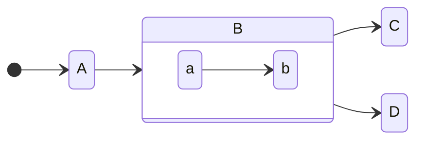

# テストページ

Emanote でサポートされている拡張 MD のテスト。

## 見出し

# H1

## H2

### H3

#### H4

##### H5

## 文章

文章のダミー。

こんにちは。あいうえお。お腹が空いた。
あｓｄふぁｓｄｆ

## Links

```md
<!-- 普通のリンク -->

[emanote 公式](https://emanote.srid.ca/)

<!-- WikiLinks -->

[[ファイル名(拡張子は不要)]]

[[ファイル名|リンクのタイトル]]

<!-- 存在しないリンク -->

[[存在しないファイル名]]
```

[emanote 公式](https://emanote.srid.ca/)

[[hoge]]

[[hoge|hoge へのリンクDESU]]

[[ほげほげほげ]]

WikiLinks のシンタックスの詳細は[ここ](https://github.com/EmaApps/emanote/blob/master/src/Emanote/Pandoc/Markdown/Syntax/WikiLink.hs)

### ページ一覧クエリ

````md
<!-- 一覧表示したいページのクエリを指定 -->

```query
path:test/*
```

<!-- 相対パスでもおｋ -->

```query
path:./*
```
````

```query
path:./*
```

## 脚注 (Footnotes)

脚注[^1]のデモ.

ほげほげほげ[^2]ふがふがふが[^1]もげ

[^1]: これは脚注 1 です
[^2]: koreha 脚注 2 dayo

## コードブロック

```ts
const a: string = "a text";
```

## 数式

MathJax

$a^2 + b ^ 2 = c$ ← 右クリで MathJax のメニュー

## Mermaid

````md

````


## Definition lists

Fruits
: Apples
: Oranges

## Hash Tags

`#tag名` で hash tag

#emanote #howto 

階層構造を持てる

#syntax/fuga
#syntax/hoge
#syntax/moge/yo

## Custom CSS styling 

:::{.sticky-note}
**スティッキーノート**

あいうえお
:::

:::{.highlight-block}
ハイライトブロック

commonmark の attributes extension 形式で CSS クラス名を指定できる

スティッキーノート `.sticky-note ` と ハイライトブロック `.highlight-block` のスタイルはビルトイン
:::

## 埋め込み

他のページ、あるいは画像や動画ファイルを埋め込みできる(画像や動画に関しては拡張子が必要)

対応している画像や動画の拡張子一覧は[この辺り](https://github.com/EmaApps/emanote/blob/40c4791f9fda5ef77061e255b6182c9611808c45/src/Emanote/Pandoc/Renderer/Embed.hs#L87-L103)

```md
![[ファイル名]]
```

![[hoge]]

